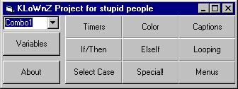



## VB Basix

### Description

Variables, combo boxs, timers, color, if/then, elseif, looping, select case, special (clipboard), and menus. Look at the screen shot. If you download this please vote for me and leave comments.
 
### More Info
 

             |
---                |---
**Submitted On**   |2002-04-28 12:33:46
**By**             |[KLoWnZ](https://github.com/Planet-Source-Code/PSCIndex/blob/master/ByAuthor/klownz.md)
**Level**          |Beginner
**User Rating**    |3.0 (18 globes from 6 users)
**Compatibility**  |VB 6\.0
**Category**       |[Coding Standards](https://github.com/Planet-Source-Code/PSCIndex/blob/master/ByCategory/coding-standards__1-43.md)
**World**          |[Visual Basic](https://github.com/Planet-Source-Code/PSCIndex/blob/master/ByWorld/visual-basic.md)
**Archive File**   |[VB\_Basix767484282002\.zip](https://github.com/Planet-Source-Code/klownz-vb-basix__1-34189/archive/master.zip)

